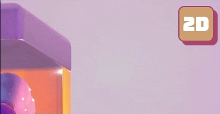
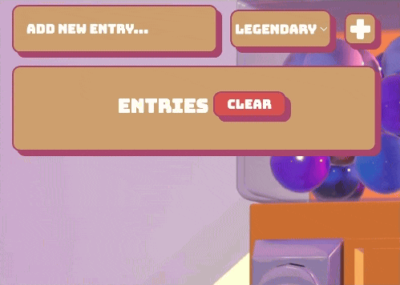

# Gacha Machine Web Application

This project is a 3D Gacha Machine web application, developed as a learning exercise to deepen my understanding of web development, 3D graphics on the web, and related technologies. All models were created by me in Blender. This project also serves as a portfolio piece to showcase my skills.

[Github Pages Demo](https://gametail.github.io/gacha-machine/)

## 🛠️ Tech Stack

- **Vite**
- **TypeScript**
- **HTML/CSS**
- **Three.js**

## ✨ Features

- **3D/2D Toggle**: Switch between a live 3D render and a pre-rendered video version using the button located at the top right. The default mode is 3D, as this is the core focus of the project. Your preference is saved to local storage.

  

- **Rarity-Based Entry Management**: Add entries by typing in the input field and pressing the "+" button (or hitting enter). You can change the rarity between Common, Rare, Epic, and Legendary using the dropdown next to the input field before adding an entry.

  

  Batch entry addition is also supported—simply separate values with commas. All entries added in a batch will share the selected rarity.

  

  You can delete individual entries by clicking on them in the entry list or clear the entire list.

  

- **Rolling**: The roll button only works when there is at least one entry in the list. Rolling selects a random entry, with the result influenced by the configured rarity probabilities.

  

- **Post-Roll Selection**: After rolling, you can pick a rolled entry with the pick button that appears next to the roll button, to remove it from the list and add it to the entry history. The most recently picked entry is displayed above the input field. If there is at least one entry in the history, you can revert your last selection using the button that appears next to the entry, moving it back to the entries list.
  Clicking the last selection copies the value to the clipboard.

- **Customizable Probability Sliders**: Adjust the chances of receiving different rarities via the multi slider in the settings.

  

## 🚨 Known/Possible Issues

- **Flickering in initial capsule opening animation (3D mode)**
- **Occasional timing discrepancies between animations and UI**
- **Video may play multiple times in 2D mode**
- **Last frame of the video may be displayed after playback in 2D mode**
- **Videos in 2D mode may appear blurry initially if their resolution differs from the device's resolution**
- **The application is not fully responsive**
